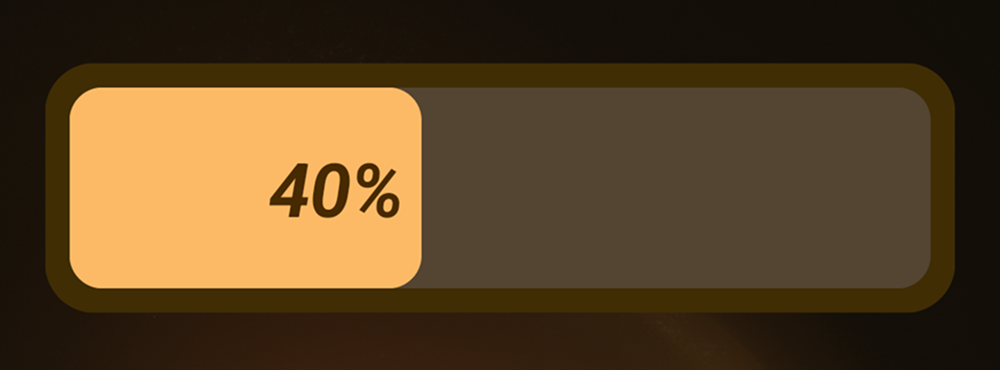
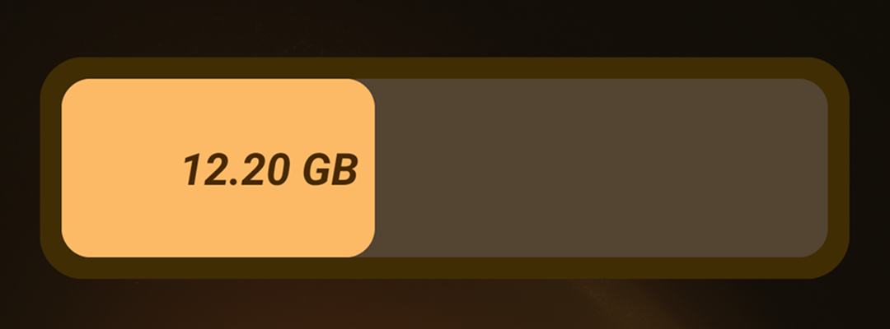
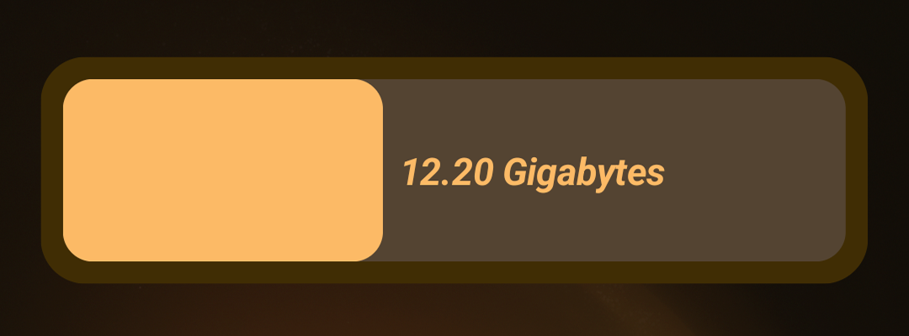
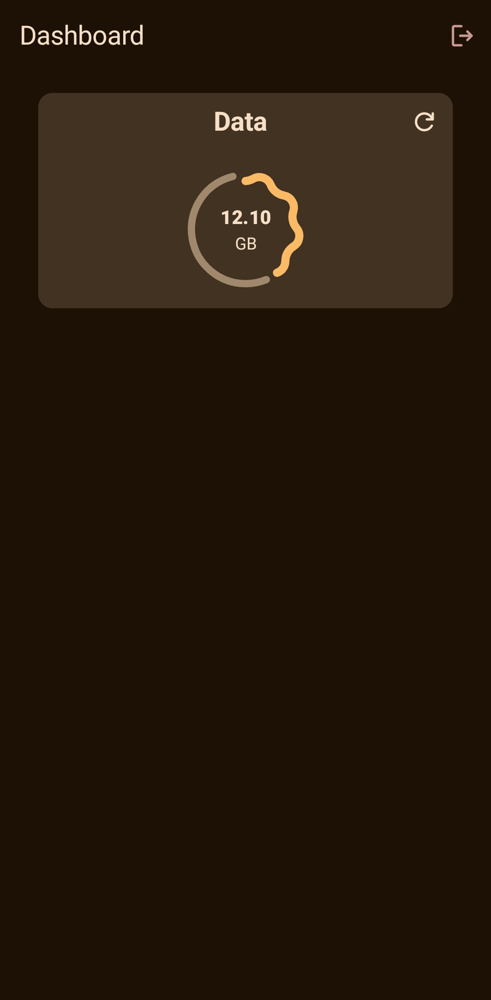
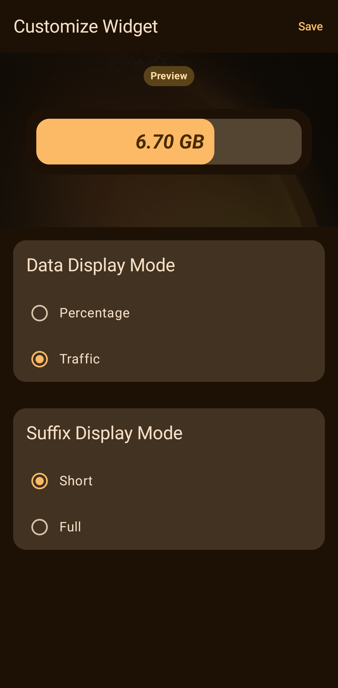

# Net Widget

[](https://android.com)
[](https://kotlinlang.org)
[](https://developer.android.com/jetpack/compose)

A modern, open-source Android home screen widget designed to help you track and monitor your
remaining mobile internet quota at a glance. Built with the latest Android technologies like Jetpack
Glance and Compose.

## ✨ Features

- **Real-time Monitoring**: Stay updated on your remaining data quota and traffic usage.
- **Jetpack Glance Widgets**: Native-feeling, responsive widgets that integrate perfectly with the
  Android home screen.
- **Live Previews**: Configure your widget with a live preview before adding it to your home screen.
- **Material You**: Full support for dynamic color schemes and Material 3 design principles.
- **Dual Language**: Full support for English and Farsi with proper RTL layout handling.
- **Background Updates**: Uses WorkManager for efficient and reliable data synchronization.

## 📱 Screenshots

|                                   Widget Previews                                   |
|:-----------------------------------------------------------------------------------:|
|      |
|  |
|    |

<table>
  <tr>
    <th style="width:50%">Home Screen</th>
    <th style="width:50%">Configuration Screen</th>
  </tr>
  <tr>
    <td></td>
    <td></td>
  </tr>
</table>

## 🚀 Getting Started

### Prerequisites

- Android 12 (API 31) or higher.
- A Shatel Mobile account.

### Installation

#### 📥 Download

You can download the latest stable APK from
the [Releases](https://github.com/amirkazemzade/NetWidget/releases) page and install it directly on
your Android device.

#### 🏗️ Build from Source

If you prefer to build the application yourself:

1. Clone the repository:
   ```bash
   git clone https://github.com/amirkazemzade/NetWidget.git
   ```
2. Open the project in **Android Studio** (Ladybug or newer recommended).
3. Sync the project with Gradle files.
4. Build and run the `app` module on your device or emulator.

## 📡 Supported Operators

Currently, Net Widget supports:

- **Shatel Mobile** (Iran)

*Support for additional operators is planned. Contributions are welcome!*

## 🛠 Tech Stack

- **UI
  **: [Jetpack Compose](https://developer.android.com/jetpack/compose) & [Material 3](https://m3.material.io/)
- **Widgets**: [Jetpack Glance](https://developer.android.com/jetpack/compose/glance)
- **Dependency Injection
  **: [Hilt](https://developer.android.com/training/dependency-injection/hilt-android)
- **Networking
  **: [Retrofit](https://square.github.io/retrofit/) & [Kotlin Serialization](https://kotlinlang.org/docs/serialization.html)
- **Persistence**: [DataStore](https://developer.android.com/topic/libraries/architecture/datastore)
- **Background Tasks
  **: [WorkManager](https://developer.android.com/topic/libraries/architecture/workmanager)

## ⚠️ Known Issues

- **Per-App Language Padding**: Widget text may have inconsistent padding when the per-app language
  direction (e.g., RTL) differs from the system locale (e.g., LTR). This is a known limitation in
  the Glance API's handling of remote views.
- **Auto-Fill State**: The save suggestion for autofill is currently not fully functional, and state
  persistence for two-step login flows is being improved.

## 🤝 Contributing

Contributions are what make the open-source community such an amazing place to learn, inspire, and
create. Any contributions you make are **greatly appreciated**.

**Special Note on Compatibility:**
Currently, the app is optimized for Android 12+. Due to limited access to physical legacy devices
and emulator resources, testing for older versions is restricted. If you have access to an older
device and can verify a build or provide fixes, please submit a Pull Request!

1. Fork the Project
2. Create your Feature Branch (`git checkout -b feature/AmazingFeature`)
3. Commit your Changes (`git commit -m 'Add some AmazingFeature'`)
4. Push to the Branch (`git push origin feature/AmazingFeature`)
5. Open a Pull Request

## 📄 License

Distributed under the MIT License. See `LICENSE` for more information.

---
*Developed with ❤️ by [Amir Kazemzade](https://github.com/amirkazemzade)*
